# ShapeScript IDE

> A C#/.NET graphical programming environment featuring a custom domain-specific language (DSL) for creating and manipulating graphics through code.


## Overview

**ShapeScript IDE** is a desktop graphical programming environment developed in **C# using Windows Forms and .NET Framework 4.7.2**.

Instead of entering drawing values through conventional form controls, users write programs using a custom command-based language. ShapeScript interprets these instructions and dynamically renders the resulting graphics on the application's drawing canvas.

The language supports:

- **Variables and arithmetic operations**
- **Single-line and multi-line conditional statements**
- **While loops**
- **User-defined methods with and without parameters**
- **Shape creation and positioning commands**
- **Pen colour and fill controls**
- **Program validation with line-specific error reporting**

### Application Interface

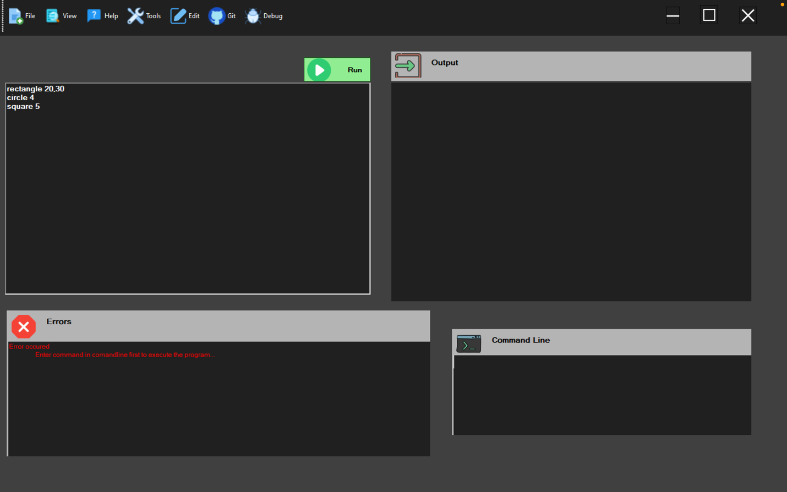

---

## Language Features

ShapeScript combines graphical drawing commands with fundamental programming constructs, allowing graphical output to be generated through small programs rather than direct GUI input.

### Variables & Arithmetic

Numerical values can be stored in variables and later referenced by drawing commands.

```text
radius = 100
pen yellow
fill on
moveto 200,200
circle radius
```

Here, `radius` is assigned once and then supplied to the `circle` command.

Basic arithmetic operations are also supported:

`+` &nbsp;&nbsp; `-` &nbsp;&nbsp; `*` &nbsp;&nbsp; `/`

#### Variable-Based Drawing

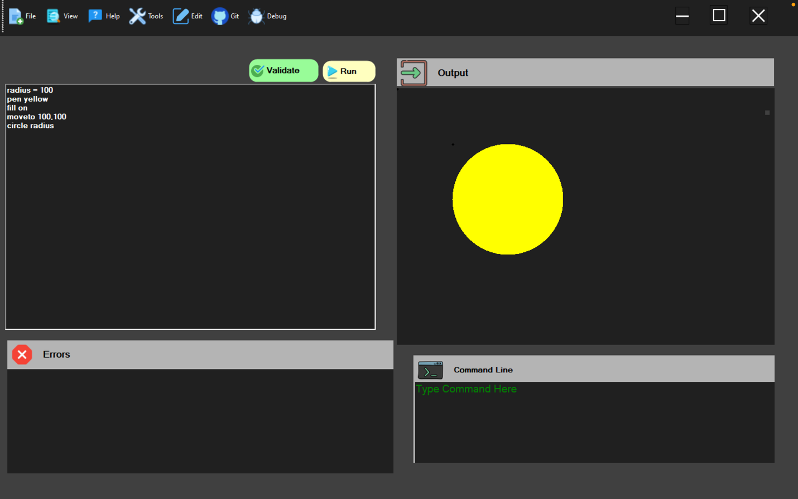

### Conditional Statements

ShapeScript supports conditional execution using the following comparison operators:

`==` &nbsp;&nbsp; `!=` &nbsp;&nbsp; `<` &nbsp;&nbsp; `<=` &nbsp;&nbsp; `>` &nbsp;&nbsp; `>=`

#### Single-Line IF

A condition and its command can be expressed on a single line using `then`.

```text
radius = 100
if radius >= 100 then circle radius
```

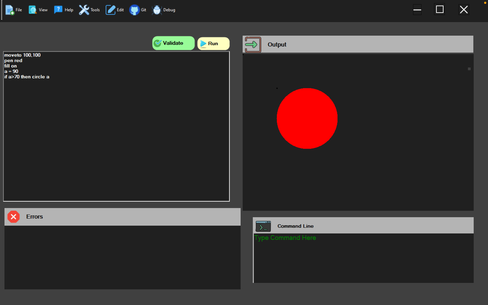

#### Multi-Line IF

Conditional blocks can also contain multiple drawing instructions.

```text
radius = 100

if radius >= 100
    pen yellow
    fill on
    circle radius
endif
```

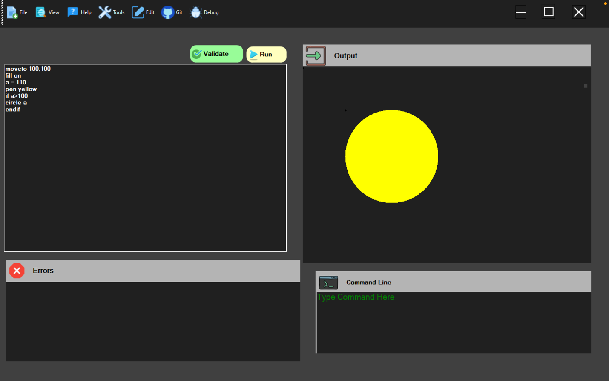

### While Loops

`while` loops repeatedly execute a block of instructions while a condition remains true.

Variables can be updated during each iteration, allowing relatively small programs to generate repeated or progressively changing graphical patterns.

```text
while condition
    commands
    variable update
endloop
```

#### Progressive Rectangle Pattern

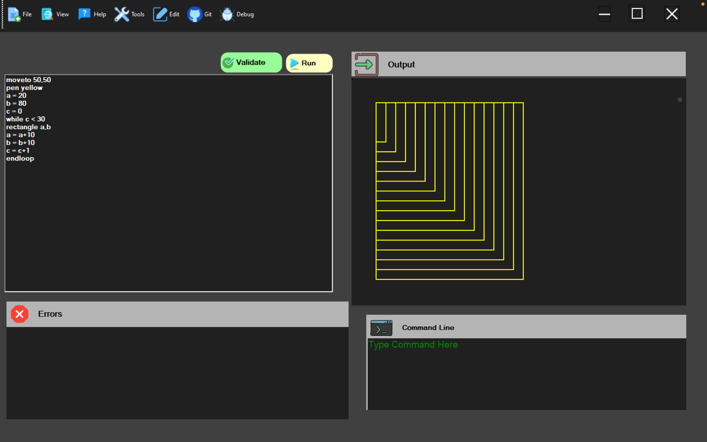

#### Progressive Circle Pattern

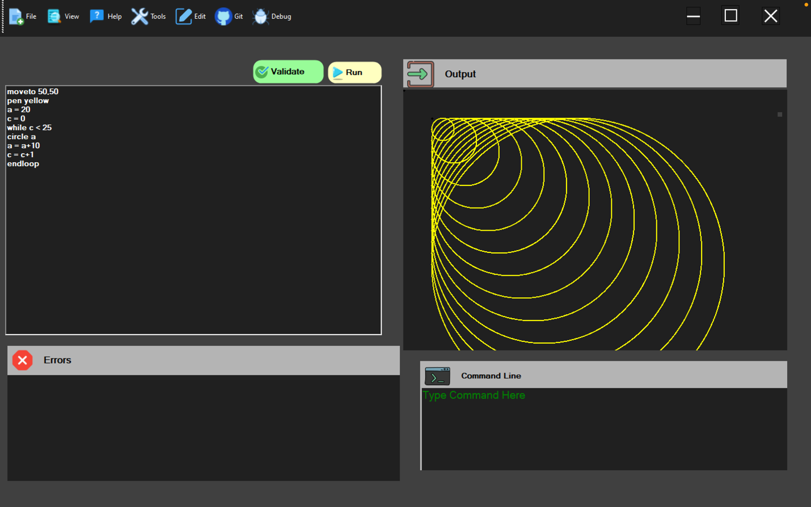

### User-Defined Methods

ShapeScript supports reusable blocks of instructions through **user-defined methods**, both with and without parameters.

#### Methods Without Parameters

Methods can group predefined drawing operations that can be executed through a method call.

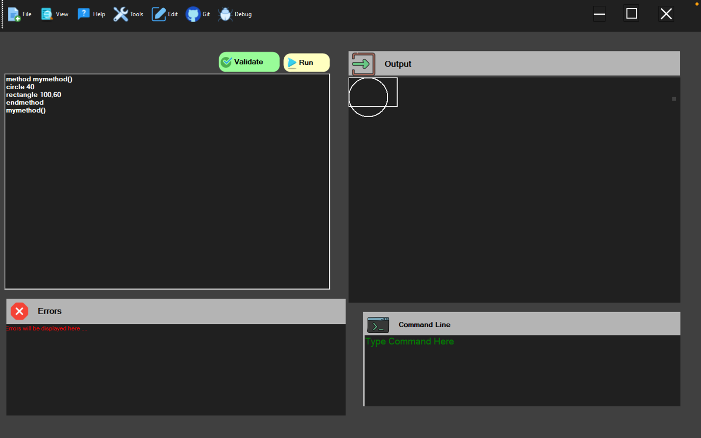

#### Methods With Parameters

Parameterised methods allow values supplied during a method call to influence the drawing operations contained within the method.

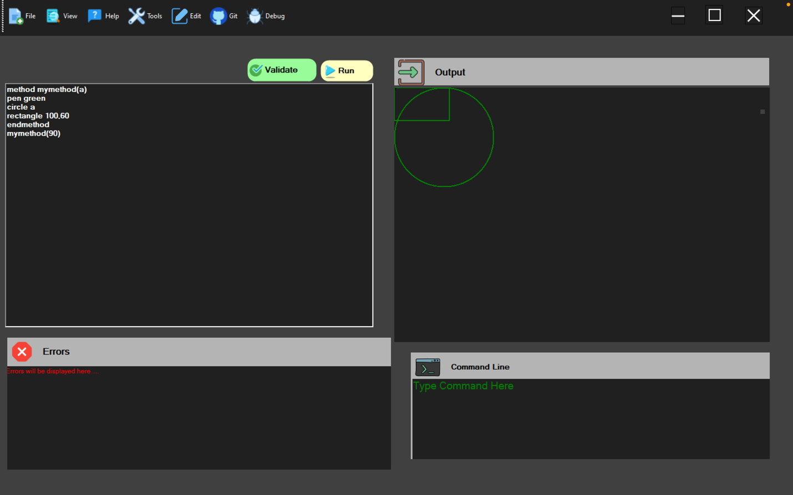

---

## Graphics & Drawing

Drawing commands are interpreted and translated into graphical output on the application's canvas.

### Supported Drawing Operations

- **Circle**
- **Rectangle**
- **Square**
- **Triangle**
- **Line drawing**
- **Canvas positioning**

Shape dimensions and positions can be provided directly or through variables, allowing the drawing system to interact with the language's programming features.

### Drawing Controls

ShapeScript maintains graphical state through commands including:

- **Pen colour** — changes the colour of subsequent drawing operations
- **Fill control** — switches between outlined and filled shapes
- **MoveTo** — changes the current drawing position
- **DrawTo** — draws a line from the current position to another coordinate

### Shape, Colour & Fill Demonstration

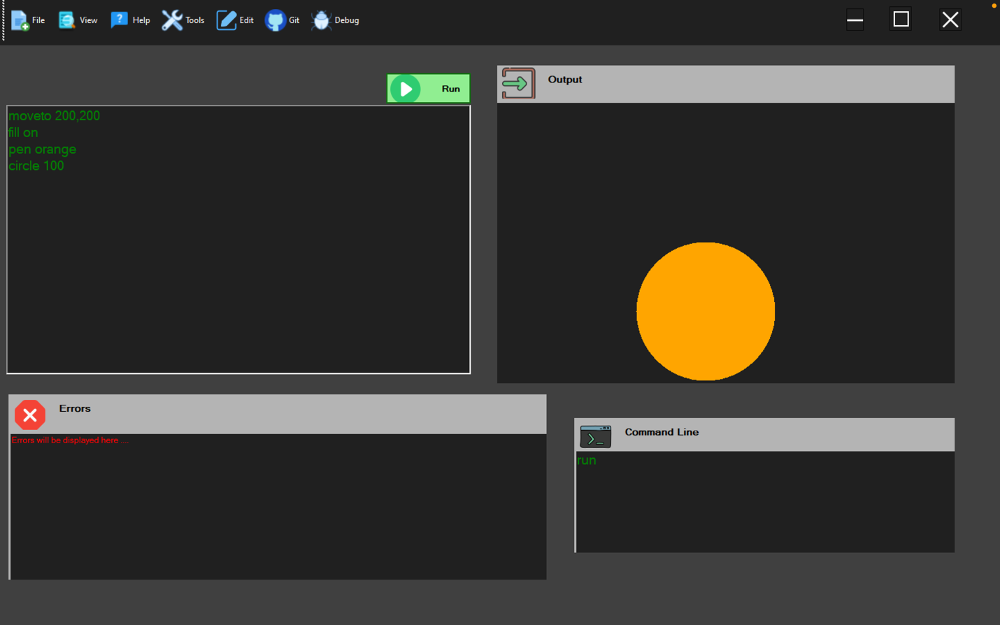

---

## Validation & Error Handling

ShapeScript includes a validation system for detecting malformed statements and incorrect commands.

The IDE contains a dedicated **Errors** area and associates detected problems with their corresponding source-code line, helping users locate errors within their programs.

Validation includes:

- Invalid or unrecognised commands
- Incorrect command parameters
- Undefined or invalid variables
- Invalid conditional syntax
- Invalid `while` loop syntax
- Invalid method declarations
- Missing or incorrectly structured statements

### Validation Example

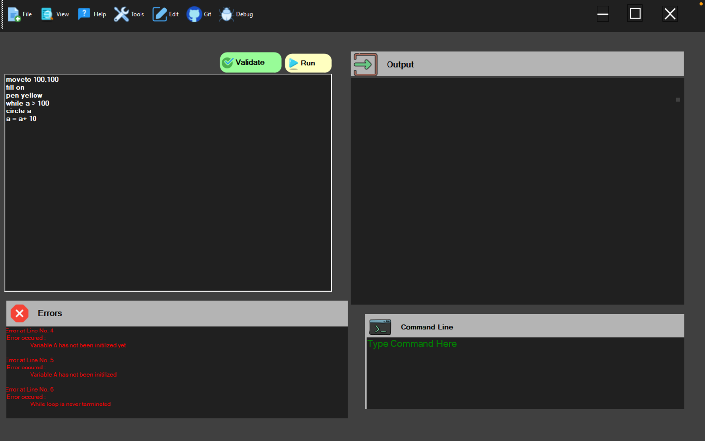

---

## Architecture & Design

ShapeScript separates command processing, graphical object creation and individual shape behaviour through an object-oriented design.

### Execution Flow

```text
User Program
     ↓
Windows Forms IDE
     ↓
Program Reader / Statement Recognition
     ↓
Command Parser & Control-Flow Processing
     ↓
Shape Factory
     ↓
Concrete Shape Objects
     ↓
System.Drawing
     ↓
Graphical Output
```

### Shape Architecture

The graphical system is built around a common shape abstraction:

- **`Shapes` interface** — defines common shape behaviour
- **`Shape` base class** — maintains shared shape state
- **`Circle`** — circle-specific rendering
- **`Rectangle`** — rectangle-specific rendering
- **`Square`** — square-specific rendering
- **`Triangle`** — triangle-specific rendering
- **`DrawLine`** — line drawing between coordinates

### Factory Pattern

`ShapeFactory` separates graphical object creation from command interpretation.

```text
"CIRCLE"     → ShapeFactory → Circle
"RECTANGLE"  → ShapeFactory → Rectangle
"SQUARE"     → ShapeFactory → Square
"TRIANGLE"   → ShapeFactory → Triangle
```

This allows the command-processing system to request shapes without directly depending on their concrete implementations.

### UML Class Diagram

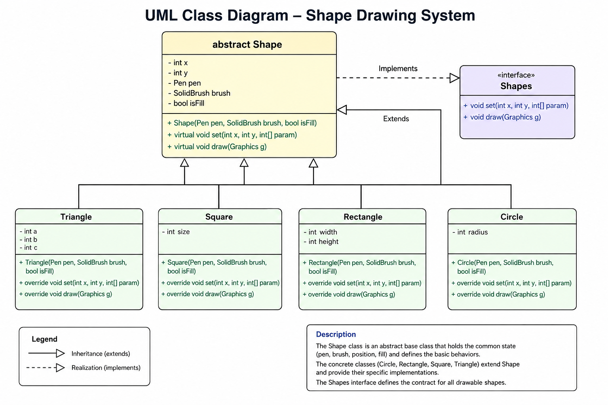

---

## Technology Stack

| Technology | Purpose |
|---|---|
| **C#** | Core application and interpreter implementation |
| **.NET Framework 4.7.2** | Application runtime |
| **Windows Forms** | Desktop graphical interface |
| **System.Drawing** | Shape rendering and graphical output |
| **Regular Expressions** | Parsing and validating parts of the custom language |
| **Visual Studio** | Development environment |

---

## Project Structure

```text
ShapeScript-IDE/
│
├── CommandParser.cs       # Drawing command and parameter processing
├── Form1.cs               # IDE interface and program execution logic
├── Method.cs              # User-defined method handling
├── ShapeFactory.cs        # Shape object creation
├── Shape.cs               # Shared shape abstraction
├── Shapes.cs              # Shape interface
│
├── Circle.cs
├── Rectangle.cs
├── Square.cs
├── Triangle.cs
├── DrawLine.cs
│
├── Iterator.cs
├── NameIterator.cs
├── NameRepo.cs
├── NameRepository.cs
│
├── docs/
│   └── screenshots/       # Project demonstrations and architecture
│
└── README.md
```

---

## Project Context

ShapeScript IDE was developed as an **undergraduate software engineering project** focused on applying object-oriented programming, software design principles and programming-language concepts within a practical desktop application.

The project began with a graphical command-processing system and object-oriented shape architecture before being extended with **variables, arithmetic operations, conditional statements, loops, user-defined methods and program validation**.

Building ShapeScript provided practical experience with command interpretation, runtime state, control flow, reusable program structures, graphical rendering and object-oriented software design.

---

## Limitations & Future Improvements

ShapeScript represents an early academic implementation of a graphical DSL rather than a production-ready programming language.

Future development could include:

- A dedicated lexer and parser for more structured language processing
- Improved variable and method scoping with richer expression handling
- More comprehensive automated unit and integration testing alongside the original project testing
- IDE features such as syntax highlighting, auto-completion and richer diagnostics

These improvements would provide a path towards a more robust and extensible graphical programming environment.
